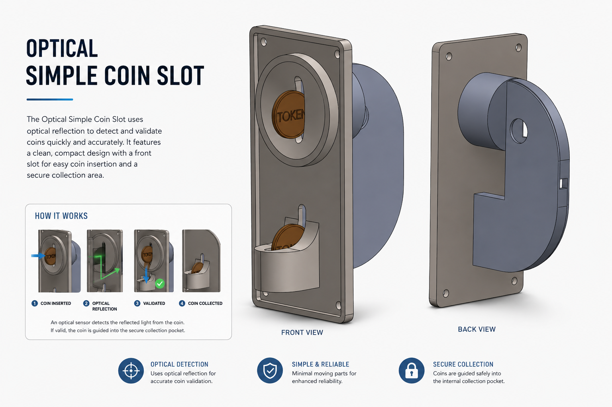
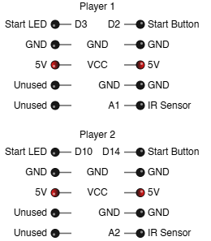
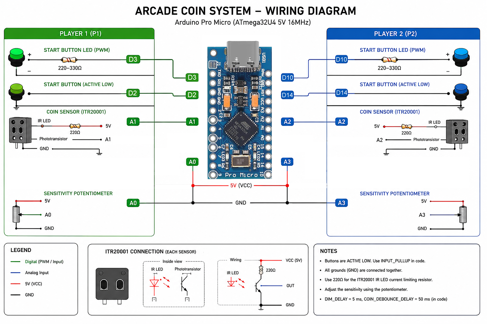

# IRCoinSlot - Optical Simple Coin Slot for DIY Arcade Machines
IR Coin Slot is a simple and effective coin detection system designed for DIY arcade machines. 
It utilizes an IR reflective sensor to detect coins as they pass through the slot, providing 
reliable and accurate coin detection for various coin sizes and materials. The design is 
compact and easy to integrate into arcade machines, making it an ideal choice for hobbyists 
and DIY enthusiasts looking to add coin-operated functionality to their projects.

## Features
- Detects coins using an IR reflective sensor.
- Simple design for easy integration into DIY arcade machines.
- Compatible with u32u4-based microcontrollers.
- Provides reliable coin detection for various coin sizes.
- Adjustable sensitivity for the sensor to accommodate different coin materials.
- Compact and durable design suitable for arcade environments.
- Easy to install and maintain.
- USB interface for easy connectivity to microcontrollers and arcade machine systems.
- Keyboard emulation support for seamless integration with arcade machine software.

## Specifications
- Sensor Type: ITR20001/T IR Reflective Sensor
- Coin Detection Range: 10mm to 20mm
- Power Supply: 5V USB
- Output: USB HID (Keyboard Emulation)
- Dimensions: 50mm x 100mm x 4mm

## Concept image

## Installation
1. Make 1 x 28mm holes in your arcade machine's coin slot area to mount the coin slot securely.
2. Use the measurement guide provided to ensure proper alignment of the second hole for the coin slot.
3. Install the coin guides on the inside of the arcade machine in the 2 x 28mm holes.
4. Align the coin slot front plate with the holes and secure it in place using screws or adhesive.
5. Mount the IR sensor in the designated square hole in the coin guides, ensuring it is properly positioned to detect coins passing through the slot.
6. Connect the sensor to the microcontroller in the proper IO ports as per the wiring diagram provided in the documentation.
7. Connect a 10 kohm potentiometer to the sensor for sensitivity adjustment, if necessary.
8. Flash the microcontroller with the appropriate firmware to enable coin detection functionality.
9. Test the coin slot by inserting coins and verifying that the sensor detects them correctly and sends the appropriate signals to the microcontroller.
10. Adjust the sensitivity of the sensor using the potentiometer if needed to ensure reliable coin detection for different coin types and materials.

## Pinouts

### Pin headers out from CoinSlot Controller Box

### Wiring Diagram
